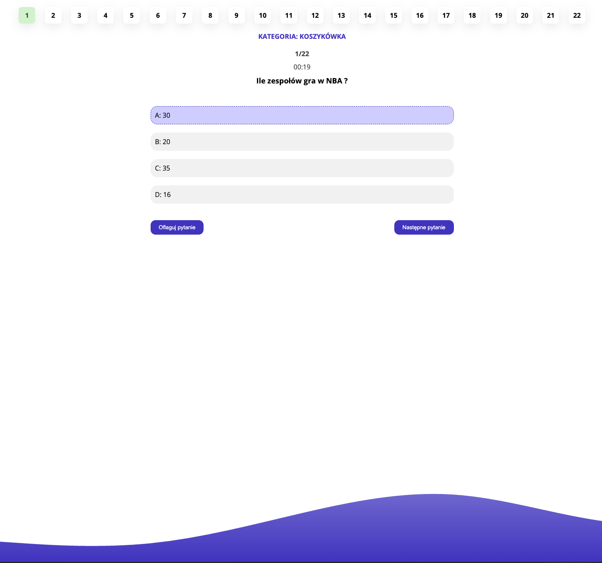
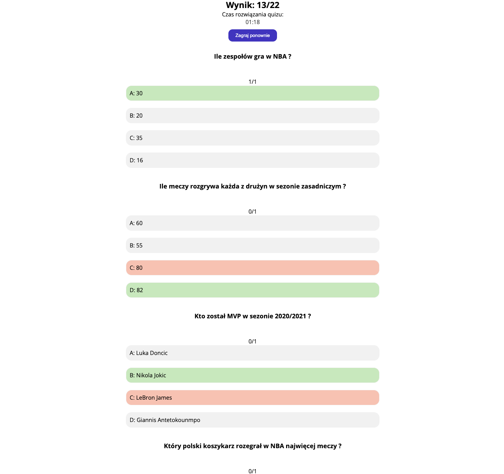

# Quiz React

A responsive and interactive quiz application built with React.

## Table of Contents

- [Quiz React](#quiz-react)
  - [Table of Contents](#table-of-contents)
  - [Overview](#overview)
  - [Key Features](#key-features)
  - [Technologies Used](#technologies-used)
    - [Frontend Technologies](#frontend-technologies)
  - [Getting Started](#getting-started)
    - [Prerequisites](#prerequisites)
    - [Installation and Setup](#installation-and-setup)

## Overview

Quiz React is a web application that allows users to test their knowledge across different categories. The application features a clean, user-friendly interface where users can:

- Select quiz categories
- Answer questions
- Flag difficult questions for review
- Track time spent on the quiz
- Review answers and see their score at the end

[Live Demo](https://radekrzepka.github.io/quiz-react)




## Key Features

- **Category Selection**: Choose from various quiz categories
- **Interactive Question Interface**: User-friendly interface for answering questions
- **Question Navigation**: Easily navigate between questions
- **Question Flagging**: Mark difficult questions for later review
- **Timer**: Track the time spent on the quiz
- **Results Review**: See detailed results with correct answers after completing the quiz

## Technologies Used

### Frontend Technologies

- **Framework**: React.js
- **State Management**: React Hooks (useState, useEffect, useRef)
- **Styling**: CSS Modules
- **Deployment**: GitHub Pages

## Getting Started

### Prerequisites

- Node.js (v12+)
- npm (v6+)

### Installation and Setup

1. Clone the repository:

   ```
   git clone https://github.com/radekrzepka/quiz-react.git
   ```

2. Navigate to the project directory:

   ```
   cd quiz-react
   ```

3. Install dependencies:

   ```
   npm install
   ```

4. Start the development server:

   ```
   npm start
   ```

5. To build for production:

   ```
   npm run build
   ```

6. To deploy to GitHub Pages:
   ```
   npm run deploy
   ```
